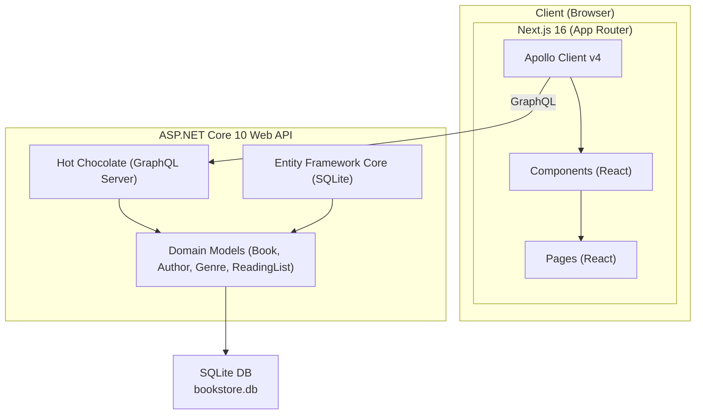
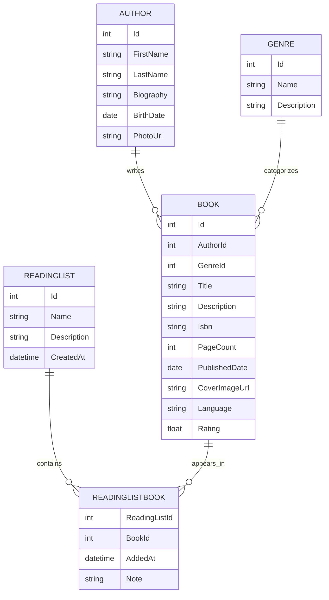
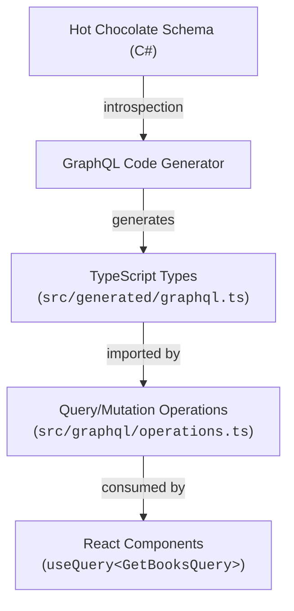

# Architecture Documentation

## Overview

**BookVault** is a full-stack sample application demonstrating the integration of a **React + Next.js** front end with an **ASP.NET Core** back end, using **GraphQL** for type-safe, efficient communication between layers.



## Technology Stack

| Layer           | Technology              | Purpose                                     |
| --------------- | ----------------------- | ------------------------------------------- |
| Frontend        | Next.js 16 (App Router) | React framework with SSR/SSG                |
| UI Styling      | Tailwind CSS v4         | Utility-first CSS                           |
| Icons           | Lucide React            | SVG icon library                            |
| GraphQL Client  | Apollo Client v4        | Type-safe GraphQL queries & mutations       |
| Type Generation | GraphQL Code Generator  | Auto-generates TypeScript types from schema |
| Backend         | ASP.NET Core 10         | Web API framework                           |
| GraphQL Server  | Hot Chocolate v14       | .NET GraphQL server                         |
| ORM             | Entity Framework Core   | Database access & migrations                |
| Database        | SQLite                  | Lightweight relational database             |

## Project Structure

```
nextjs-aspnet-sample/
├── backend/
│   └── BookStore.Api/
│       ├── Data/
│       │   ├── AppDbContext.cs          # EF Core DbContext & configuration
│       │   └── SeedData.cs             # Initial seed data (books, authors, etc.)
│       ├── Models/
│       │   ├── Author.cs               # Author entity
│       │   ├── Book.cs                 # Book entity
│       │   ├── Genre.cs                # Genre entity
│       │   ├── ReadingList.cs          # Reading list entity
│       │   └── ReadingListBook.cs      # Many-to-many join entity
│       ├── GraphQL/
│       │   ├── Query.cs                # GraphQL query resolvers
│       │   ├── Mutation.cs             # GraphQL mutation resolvers + input types
│       │   └── Types/
│       │       ├── AuthorType.cs       # Author GraphQL type configuration
│       │       ├── BookType.cs         # Book GraphQL type configuration
│       │       ├── GenreType.cs        # Genre GraphQL type configuration
│       │       └── ReadingListType.cs  # Reading list GraphQL type configuration
│       ├── Program.cs                  # Application entry point & DI setup
│       └── appsettings.json            # Configuration
├── frontend/
│   ├── src/
│   │   ├── app/                        # Next.js App Router pages
│   │   │   ├── page.tsx                # Home page (dashboard)
│   │   │   ├── layout.tsx              # Root layout with Apollo & Navbar
│   │   │   ├── books/
│   │   │   │   ├── page.tsx            # Books listing
│   │   │   │   ├── [id]/page.tsx       # Book detail
│   │   │   │   └── new/page.tsx        # Add new book form
│   │   │   ├── authors/
│   │   │   │   ├── page.tsx            # Authors listing
│   │   │   │   ├── [id]/page.tsx       # Author detail
│   │   │   │   └── new/page.tsx        # Add new author form
│   │   │   └── reading-lists/
│   │   │       ├── page.tsx            # Reading lists
│   │   │       └── [id]/page.tsx       # Reading list detail
│   │   ├── components/                 # Shared UI components
│   │   │   ├── BookCard.tsx            # Book card for grid displays
│   │   │   ├── ErrorMessage.tsx        # Error display component
│   │   │   ├── Navbar.tsx              # Navigation bar
│   │   │   ├── Spinner.tsx             # Loading spinner
│   │   │   └── StarRating.tsx          # Star rating display
│   │   ├── graphql/
│   │   │   └── operations.ts           # All GraphQL queries & mutations
│   │   ├── generated/
│   │   │   └── graphql.ts              # Auto-generated TypeScript types
│   │   └── lib/
│   │       └── apollo-provider.tsx      # Apollo Client setup & provider
│   ├── codegen.ts                      # GraphQL Code Generator config
│   └── .env.local                      # Environment variables
├── ARCHITECTURE.md                     # This file
└── README.md                           # Getting started guide
```

## Key Design Decisions

### 1. GraphQL as the Communication Layer

**Why GraphQL over REST?**

- **Type safety**: The schema acts as a contract between FE and BE. GraphQL Code Generator creates TypeScript types from the schema automatically, ensuring compile-time type checking.
- **Efficiency**: Clients request exactly the data they need — no over-fetching or under-fetching. A book listing page only requests `title`, `author.name`, and `rating`, while the detail page fetches everything.
- **Single endpoint**: All operations go through `/graphql`, simplifying API management.
- **Built-in filtering & sorting**: Hot Chocolate provides `[UseFiltering]` and `[UseSorting]` attributes that automatically expose filter/sort capabilities through the schema.

### 2. Hot Chocolate GraphQL Server

Hot Chocolate was chosen as the GraphQL server for .NET because:

- Native .NET integration with dependency injection
- Excellent Entity Framework Core integration for efficient database queries
- Code-first schema definition with type descriptors
- Built-in filtering, sorting, and projection support
- Banana Cake Pop — built-in GraphQL IDE at `/graphql`

### 3. Entity Framework Core with SQLite

- **SQLite** for zero-configuration development (no database server needed)
- EF Core provides a clean repository pattern via `DbSet<T>`
- `EnsureCreated()` + seed data in `OnModelCreating()` for automatic setup
- Easily swappable to PostgreSQL/SQL Server for production

### 4. Next.js App Router

- App Router provides the latest React Server Components architecture
- File-based routing with dynamic segments (`[id]`)
- Client Components (`"use client"`) for interactive pages with Apollo hooks
- Built-in optimizations (code splitting, image optimization)

### 5. Apollo Client v4

- `useQuery` / `useMutation` hooks for declarative data fetching
- Normalized cache (`InMemoryCache`) for automatic UI updates
- `refetchQueries` for cache invalidation after mutations
- Type-safe when combined with generated types from codegen

### 6. GraphQL Code Generator

- Introspects the Hot Chocolate schema and generates TypeScript types
- Query/mutation operation types match exactly what the server returns
- Ensures FE and BE stay in sync — breaking changes caught at build time

## Data Model



## GraphQL API

### Queries

| Query                 | Description                                     |
| --------------------- | ----------------------------------------------- |
| `books`               | List all books (supports filtering & sorting)   |
| `bookById(id)`        | Get a single book with full details             |
| `authors`             | List all authors (supports filtering & sorting) |
| `authorById(id)`      | Get a single author with their books            |
| `genres`              | List all genres                                 |
| `readingLists`        | List all reading lists with their books         |
| `readingListById(id)` | Get a single reading list                       |

### Mutations

| Mutation                                            | Description               |
| --------------------------------------------------- | ------------------------- |
| `addBook(input)`                                    | Create a new book         |
| `updateBook(id, input)`                             | Update an existing book   |
| `deleteBook(id)`                                    | Delete a book             |
| `addAuthor(input)`                                  | Create a new author       |
| `updateAuthor(id, input)`                           | Update an existing author |
| `deleteAuthor(id)`                                  | Delete an author          |
| `createReadingList(input)`                          | Create a new reading list |
| `addBookToReadingList(readingListId, bookId, note)` | Add a book to a list      |
| `removeBookFromReadingList(readingListId, bookId)`  | Remove a book from a list |
| `deleteReadingList(id)`                             | Delete a reading list     |

## Type Safety Flow



This creates an end-to-end type-safe pipeline: changes to the C# models propagate through the GraphQL schema to generated TypeScript types, catching mismatches at compile time.

## Running the Application

See [README.md](./README.md) for setup instructions.
